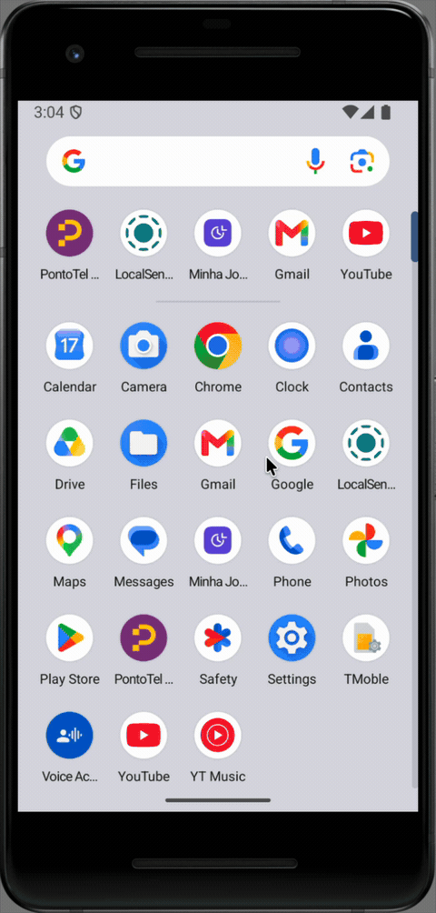

# BatePonto SDK para Android

Integre a experiência do BatePonto ao seu aplicativo, com login, telas e navegação conduzidos pelo próprio módulo.

**Guia do integrador · versão 0.1.0-local · 17 de setembro de 2026**

<a id="visao-geral"></a>

## Visão geral

O BatePonto SDK é uma distribuição Android binária. Seu aplicativo oferece um ponto de entrada — por exemplo, um botão **Abrir BatePonto** — e o SDK abre uma Activity em tela cheia dentro do mesmo aplicativo. Ao sair pela navegação do BatePonto, o usuário retorna à tela do hospedeiro.

O mesmo SDK foi integrado a um aplicativo Kotlin nativo e ao LocalSend, desenvolvido em Flutter. O login acontece dentro do BatePonto. A integração não exige Node, Metro ou os fontes React Native do BatePonto no projeto consumidor.

> **Sobre esta versão**
> Esta é uma prévia de integração Android ARM64, distribuída como `0.1.0-local`. Os exemplos comprovam integração em Kotlin e Flutter; não representam homologação de todos os aplicativos, dispositivos ou fluxos. Revise [Requisitos e compatibilidade](#requisitos-e-compatibilidade) antes de começar.

### A experiência do usuário

1. O usuário toca no botão do seu aplicativo.
2. O BatePonto abre sua própria tela, solicita as permissões necessárias e conduz o login, quando necessário.
3. O usuário navega no BatePonto.
4. A navegação de saída retorna ao aplicativo hospedeiro.

O módulo executa **no mesmo processo e pacote Android** do hospedeiro. Uma Activity própria organiza a interface e o ciclo de vida; ela não cria uma fronteira de segurança entre aplicativos.

<a id="demonstracao-integracao"></a>



### Escolha seu caminho

- **Android Kotlin ou Java:** configure a dependência e chame `BatePontoSdk.open(Activity)`. Siga [Integração Android](#integracao-android).
- **Flutter para Android:** configure o módulo Android e encaminhe a ação por `MethodChannel`. Siga [Integração Flutter](#integracao-flutter).
- **Hospedeiro que já usa React Native:** esta versão não oferece integração binária direta suportada. Alinhe uma integração específica antes de adotar o pacote.

<a id="requisitos-e-compatibilidade"></a>

## Requisitos e compatibilidade

Os valores abaixo descrevem a configuração usada nos exemplos. Preserve o identificador, a assinatura e as integrações existentes do seu aplicativo.

| Item | Configuração de referência |
| --- | --- |
| Plataforma | Android |
| Arquitetura incluída | `arm64-v8a` |
| `minSdk` dos exemplos | 26 — Android 8.0 |
| `compileSdk` / `targetSdk` dos exemplos | 36 / 36 |
| Java e alvo JVM | 17 |
| Android Gradle Plugin | 8.12.0 |
| Kotlin | 2.1.20 |
| Gradle no exemplo nativo | 9.0.0 |
| Gradle no exemplo Flutter | 8.13 |
| Flutter / Dart do exemplo | 3.24.5 / 3.5.4 |
| Dispositivo exercitado | Emulador Android 16/API 36, ARM64, páginas de 4 KB |

O módulo SDK declara mínimo API 24, mas os exemplos usam API 26. **Nenhum desses mínimos é uma comprovação de execução em todas as versões a partir dele.** O teste de execução desta entrega ocorreu em API 36. Adote a configuração de referência para a primeira integração e homologue a matriz real do seu produto.

### Verifique estes pontos antes de integrar

| Cenário | Estado desta distribuição |
| --- | --- |
| Android Kotlin | Integração e execução demonstradas |
| Flutter no Android | Integração e execução demonstradas |
| Java | API exposta como método estático; exemplo de chamada neste guia |
| App que já contém React Native/Expo | Requer adaptação específica; integração direta não suportada |
| App com Firebase próprio | Coexistência precisa de configuração e validação específicas |
| Android com páginas de memória de 16 KB | Não validado nesta entrega |
| ARM de 32 bits ou emulador x86/x86_64 | Binários não incluídos |
| iOS, web e desktop | Não incluídos |
| Push do BatePonto | Desativado nesta versão |
| Reconhecimento facial em aparelho físico | Motor incluído; fluxo completo ainda precisa de homologação |

O runtime embarcado utiliza Expo 55, React Native 0.83.6 e Hermes 0.14.1. Essa informação ajuda a analisar conflitos de dependências; não é necessário instalar essas ferramentas no consumidor.

<a id="o-pacote-que-voce-recebe"></a>

## O pacote que você recebe

A distribuição do SDK é o arquivo `bateponto-sdk-android-local.zip`. Extraia seu conteúdo e mantenha a pasta `maven` inteira:

```text
bateponto-sdk/
├── SDK-LEIA-ME.md
└── maven/
    ├── com/pontotel/bateponto/sdk/0.1.0-local/
    └── ... dependências e metadados dos demais módulos
```

A pasta Maven contém o AAR principal, AARs transitivos e metadados de resolução. **Copiar apenas `sdk-0.1.0-local.aar` para `libs/` não instala o SDK completo.** Não remova arquivos `.pom`, `.module` ou restrinja o repositório somente ao grupo `com.pontotel.bateponto`.

Dependências públicas adicionais são resolvidas pelo Google Maven e Maven Central. Uma máquina sem cache precisa acessar esses repositórios durante o build. O uso de `--offline` depende de um cache previamente preenchido.

Os APKs de demonstração e esta documentação podem ser fornecidos separadamente. O ZIP do SDK não contém os fontes dos hospedeiros, credenciais de login nem a chave de assinatura do seu aplicativo.

### Organização usada neste guia

```text
integracao/
├── bateponto-sdk/
│   └── maven/
├── meu-app-android/
│   ├── settings.gradle.kts
│   └── app/build.gradle.kts
└── meu-app-flutter/
    ├── lib/
    └── android/
        ├── settings.gradle.kts
        └── app/build.gradle.kts
```

Nos exemplos nativos, o Maven fica em `../bateponto-sdk/maven`, relativo à raiz Gradle. Em Flutter, a raiz Gradle fica em `android/`, portanto o caminho é `../../bateponto-sdk/maven`. Ajuste o caminho se organizar as pastas de outra forma.

<a id="integracao-android"></a>

## Integração Android

### 1. Registre o repositório Maven

Em `meu-app-android/settings.gradle.kts`, adicione o Maven local **antes** dos repositórios públicos, na configuração que seu projeto já utiliza:

```kotlin
dependencyResolutionManagement {
    repositories {
        maven { url = uri("../bateponto-sdk/maven") }
        google()
        mavenCentral()
    }
}
```

Mantenha o bloco `pluginManagement` e os plugins existentes. `pluginManagement.repositories` resolve plugins Gradle; o SDK é uma dependência do aplicativo e deve entrar nos repositórios de dependências.

Se seu projeto usa Groovy (`settings.gradle`), a configuração equivalente é:

```groovy
dependencyResolutionManagement {
    repositories {
        maven { url = uri('../bateponto-sdk/maven') }
        google()
        mavenCentral()
    }
}
```

### 2. Adicione a dependência

Em `meu-app-android/app/build.gradle.kts`:

```kotlin
dependencies {
    implementation("com.pontotel.bateponto:sdk:0.1.0-local")
}
```

Em Groovy (`app/build.gradle`):

```groovy
dependencies {
    implementation 'com.pontotel.bateponto:sdk:0.1.0-local'
}
```

Não adicione os plugins Gradle do React Native, Expo ou Google Services somente para consumir este SDK. Os binários e recursos necessários do módulo são fornecidos pela distribuição. Se esses plugins já atendem a outras funcionalidades do seu app, mantenha-os e avalie a coexistência.

### 3. Confira a configuração Android

Em `gradle.properties`, na raiz Gradle do projeto, habilite AndroidX:

```properties
android.useAndroidX=true
```

No Flutter, esse arquivo fica em `android/gradle.properties`. O exemplo Flutter validado também usa `android.enableJetifier=true` para compatibilidade com dependências legadas; avalie essa propriedade conforme o conjunto de bibliotecas do seu hospedeiro.

O trecho abaixo usa Kotlin DSL e deve ser incorporado ao bloco `android` existente. Não substitua `applicationId`, `namespace`, versão ou assinatura do hospedeiro.

```kotlin
android {
    compileSdk = 36

    defaultConfig {
        minSdk = 26
        targetSdk = 36
        ndk { abiFilters += "arm64-v8a" }
    }

    compileOptions {
        sourceCompatibility = JavaVersion.VERSION_17
        targetCompatibility = JavaVersion.VERSION_17
    }
}

kotlin {
    compilerOptions {
        jvmTarget.set(org.jetbrains.kotlin.gradle.dsl.JvmTarget.JVM_17)
    }
}
```

Esse exemplo pressupõe os plugins Android/Kotlin já configurados, com as versões da [matriz de referência](#requisitos-e-compatibilidade). Um projeto somente Java não precisa adicionar o bloco `kotlin` para chamar a API Java.

> **Distribuição ARM64**
> Garanta que a variante integrada inclua somente ABIs com todas as bibliotecas necessárias. Se o projeto já declara filtros ou splits para outras ABIs, apenas acrescentar ARM64 não remove os anteriores. A versão atual do SDK não fornece os binários para essas outras arquiteturas.

### 4. Abra o BatePonto

Na Activity visível do hospedeiro, associe a chamada a uma ação do usuário:

```kotlin
import com.pontotel.bateponto.sdk.BatePontoSdk

// Dentro da sua Activity; abrirBatePontoButton é o botão da sua tela.
abrirBatePontoButton.setOnClickListener {
    BatePontoSdk.open(this)
}
```

A chamada deve ocorrer na thread principal, com uma Activity válida. Não passe `applicationContext`, não abra a partir de um serviço e não mantenha uma referência a uma Activity destruída.

Em Java, a mesma API é estática:

```java
import com.pontotel.bateponto.sdk.BatePontoSdk;

// Dentro da MainActivity do seu aplicativo.
abrirBatePontoButton.setOnClickListener(view ->
    BatePontoSdk.open(MainActivity.this)
);
```

O manifesto da biblioteca fornece a Activity do SDK e seu tema. Não é necessário declará-la outra vez nem tornar a `Application` do hospedeiro uma `ReactApplication`. A Activity do SDK é não exportada e deve ser aberta pela API pública.

### 5. Compile e execute

A partir de `meu-app-android/`:

```sh
./gradlew :app:assembleDebug
```

Instale a variante no dispositivo ARM64 escolhido e toque no botão. Verifique a abertura da interface, as permissões e o retorno. Depois valide também a variante release e a configuração de minificação/assinatura que seu produto utiliza. O SDK usa seu bundle embarcado mesmo quando o hospedeiro é debug.

<a id="integracao-flutter"></a>

## Integração Flutter

O Flutter chama uma ponte Kotlin no projeto Android. Essa ponte invoca a mesma API utilizada pelo hospedeiro nativo. Não há pacote Dart do BatePonto para adicionar ao `pubspec.yaml` nesta distribuição.

### 1. Configure o módulo Android

Adicione a dependência `com.pontotel.bateponto:sdk:0.1.0-local` a `android/app/build.gradle.kts` ou `android/app/build.gradle`, conforme a linguagem usada no seu projeto. Use a configuração Android/JVM da [integração Android](#integracao-android).

Se os repositórios são centralizados em `android/settings.gradle.kts`, use:

```kotlin
dependencyResolutionManagement {
    repositories {
        maven { url = uri("../../bateponto-sdk/maven") }
        google()
        mavenCentral()
    }
}
```

Se o projeto declara repositórios em `android/build.gradle`, como o exemplo Flutter validado, adicione ao bloco existente:

```groovy
allprojects {
    repositories {
        maven { url rootProject.file('../../bateponto-sdk/maven') }
        google()
        mavenCentral()
    }
}
```

Escolha o local compatível com a política de repositórios do projeto; não duplique configurações se usar `FAIL_ON_PROJECT_REPOS`. Preserve `includeBuild` do Flutter, o carregador de plugins e os demais canais já existentes na Activity.

### 2. Implemente a ponte Kotlin

Em `android/app/src/main/kotlin/.../MainActivity.kt`, adapte o pacote `com.exemplo.meuapp` ao pacote da sua Activity. O exemplo abaixo mostra uma Activity mínima; incorpore o canal à Activity existente se ela já tem comportamento próprio.

```kotlin
package com.exemplo.meuapp

import com.pontotel.bateponto.sdk.BatePontoSdk
import io.flutter.embedding.android.FlutterActivity
import io.flutter.embedding.engine.FlutterEngine
import io.flutter.plugin.common.MethodChannel

class MainActivity : FlutterActivity() {
    override fun configureFlutterEngine(flutterEngine: FlutterEngine) {
        super.configureFlutterEngine(flutterEngine)

        MethodChannel(
            flutterEngine.dartExecutor.binaryMessenger,
            "com.pontotel.bateponto/sdk"
        ).setMethodCallHandler { call, result ->
            if (call.method != "open") {
                result.notImplemented()
            } else {
                try {
                    BatePontoSdk.open(this)
                    result.success(null)
                } catch (error: Exception) {
                    result.error(
                        "OPEN_FAILED",
                        "Não foi possível abrir o BatePonto.",
                        null
                    )
                }
            }
        }
    }
}
```

O nome do canal e o método devem coincidir nos dois lados. O código de erro `OPEN_FAILED` é definido por esta ponte de exemplo; não é uma enumeração de erros internos do SDK. A captura trata exceções síncronas da solicitação de abertura, não falhas assíncronas posteriores dentro do módulo.

### 3. Adicione o botão em Dart

Crie `lib/bateponto_button.dart` e use `const BatePontoButton()` dentro de uma tela com `Scaffold`. O botão abaixo está habilitado somente em Android e trata falha de abertura ou ausência da ponte.

```dart
import 'package:flutter/foundation.dart';
import 'package:flutter/material.dart';
import 'package:flutter/services.dart';

class BatePontoButton extends StatefulWidget {
  const BatePontoButton({super.key});

  @override
  State<BatePontoButton> createState() => _BatePontoButtonState();
}

class _BatePontoButtonState extends State<BatePontoButton> {
  static const _channel = MethodChannel('com.pontotel.bateponto/sdk');
  bool _opening = false;

  Future<void> _open() async {
    if (_opening) return;
    setState(() => _opening = true);
    try {
      await _channel.invokeMethod<void>('open');
    } on PlatformException {
      _showError('Não foi possível abrir o BatePonto. Tente novamente.');
    } on MissingPluginException {
      _showError('A integração Android do BatePonto não está disponível.');
    } finally {
      if (mounted) setState(() => _opening = false);
    }
  }

  void _showError(String message) {
    if (!mounted) return;
    ScaffoldMessenger.of(context).showSnackBar(
      SnackBar(content: Text(message)),
    );
  }

  @override
  Widget build(BuildContext context) {
    final isAndroid = !kIsWeb &&
        defaultTargetPlatform == TargetPlatform.android;
    return FilledButton(
      onPressed: isAndroid && !_opening ? _open : null,
      child: Text(_opening ? 'Abrindo…' : 'Abrir BatePonto'),
    );
  }
}
```

> **O que o `await` significa**
> O Future termina quando a ponte responde à solicitação de abertura. Ele não aguarda o fechamento do BatePonto e não informa sucesso de login ou marcação. O controle `_opening` evita chamadas repetidas enquanto a solicitação está pendente; ele não é um bloqueio durante toda a sessão do SDK.

### 4. Faça um build nativo completo

A partir de `meu-app-flutter/`:

```sh
flutter pub get
flutter build apk --debug --target-platform android-arm64
```

Hot reload não instala alterações Kotlin ou dependências Android. Recompile e reinstale o aplicativo após criar ou alterar a ponte. Para homologar a versão de distribuição, faça também um build release usando a assinatura do seu aplicativo:

```sh
flutter build apk --release --target-platform android-arm64
```

Mudanças de AGP, Gradle ou Java podem exigir ajustes nos demais plugins Flutter do hospedeiro. A integração demonstrada usou as versões da matriz; não atualize todas as dependências indiscriminadamente para resolver um único conflito.

<a id="referencia-da-api"></a>

## Referência da API

### `BatePontoSdk.open(activity)`

```kotlin
// activity é uma instância válida de android.app.Activity.
com.pontotel.bateponto.sdk.BatePontoSdk.open(activity)
```

| Contrato | Comportamento |
| --- | --- |
| Entrada | Uma Activity válida do aplicativo hospedeiro |
| Thread | Chamar na thread principal |
| Retorno Kotlin / Java | `Unit` / `void` |
| Efeito | Solicita a abertura da Activity do BatePonto |
| Runtime | Inicializado pelo SDK e reutilizado nas aberturas seguintes do mesmo processo |
| Autenticação | Conduzida nas telas do BatePonto |
| Resultado de negócio | Não retornado por esta API |

O método não recebe senha, token, ambiente, identidade de funcionário nem dados de marcação. Não há APIs públicas de `configure`, `close`, `logout`, consulta de ponto ou callbacks de conclusão nesta versão. Não utilize classes internas do SDK como contrato de integração.

Uma resposta bem-sucedida da ponte Flutter significa que a solicitação foi encaminhada. Não representa confirmação de tela pronta, autenticação ou registro de ponto. Eventos de ciclo de vida do hospedeiro também não devem ser interpretados como esses resultados.

<a id="navegacao-e-ciclo-de-vida"></a>

## Navegação e ciclo de vida

O BatePonto abre uma Activity própria, configurada em orientação retrato. A interface do aplicativo hospedeiro fica em segundo plano enquanto o módulo está em primeiro plano. O Android continua gerenciando ambas as Activities.

- A navegação interna recebe o botão Voltar primeiro; sair na raiz retorna ao hospedeiro.
- Algumas telas têm ações próprias de fechamento, como **Cancelar** na câmera.
- Fechar a Activity não equivale a logout. A sessão e os dados persistidos podem continuar disponíveis em outra abertura.
- O SDK gerencia seu runtime; não chame inicializadores React Native/Expo por conta própria para essa integração.
- Preserve o ciclo de vida normal de sua Activity e dos plugins já existentes.

O modo completo em tela cheia foi o caminho demonstrado. Incorporação em Fragment, View ou região de uma tela não faz parte da API oferecida.

<a id="permissoes-e-manifesto"></a>

## Permissões e manifesto

O manifesto do SDK e os manifestos de suas dependências são mesclados ao manifesto final do hospedeiro. O BatePonto conduz as solicitações em runtime conforme o fluxo. As permissões pertencem ao **aplicativo inteiro**, não apenas à Activity do SDK.

| Grupo | Uso esperado / observação |
| --- | --- |
| Câmera | Captura, reconhecimento facial e leitura por câmera |
| Localização aproximada e precisa | Recursos de localização do fluxo BatePonto |
| Microfone e áudio | Recursos de captura/áudio presentes no aplicativo |
| Internet | Autenticação, consultas e sincronização com os serviços configurados |
| Armazenamento legado | `READ_EXTERNAL_STORAGE` e `WRITE_EXTERNAL_STORAGE` limitadas a API 32 no manifesto do módulo |
| Notificações | `POST_NOTIFICATIONS` está declarada; isso não habilita push do BatePonto, que está desativado nesta versão |
| Outras declarações | Incluem serviço em primeiro plano, boot, vibração e wake lock; confira o manifesto mesclado e transitivas |

Antes da distribuição, examine a aba **Merged Manifest** do Android Studio e teste permissões negadas, concedidas apenas uma vez e revogadas. Ajuste a comunicação com o usuário às funcionalidades realmente utilizadas e às políticas do seu aplicativo. Não remova permissões exigidas para fazer o build passar sem validar os fluxos afetados.

### Coexistência com Firebase

O SDK fornece recursos de configuração Firebase. Não é necessário copiar um `google-services.json` do BatePonto para o projeto consumidor.

O manifesto do SDK define coleta automática de Analytics/Crashlytics e inicialização automática de Messaging como desativadas; também remove os componentes de Messaging do React Native Firebase usados pelo BatePonto e a permissão `AD_ID`. Esses ajustes entram no manifesto mesclado e podem afetar um hospedeiro que usa as mesmas integrações.

**Se o seu aplicativo já utiliza Firebase, alinhe e valide essa coexistência antes de adotar esta versão.** Não force a resolução com `tools:replace`, exclusões ou remoção de recursos sem avaliar qual aplicativo Firebase, serviços e políticas devem prevalecer.

Referência de plataforma: [mesclagem de manifestos no Android](https://developer.android.com/build/manage-manifests).

<a id="login-ambiente-e-dados"></a>

## Login, ambiente e dados

O login é feito pelo usuário nas telas do BatePonto. O aplicativo hospedeiro não deve coletar a senha para repassá-la ao SDK. Não há SSO nem injeção de sessão pela API pública desta versão.

O ambiente dos serviços vem configurado nos binários fornecidos. Não existe parâmetro público para trocar endpoints ou ambiente em runtime. Confirme com a equipe responsável pelo BatePonto qual ambiente está associado ao pacote recebido antes de fazer testes com dados reais.

A sessão e o banco do módulo ficam no armazenamento privado do aplicativo hospedeiro. Fechar e reabrir a tela não apaga esses dados. As regras Android e a configuração do seu app governam backup, limpeza de dados e desinstalação; revise essas políticas para os dados tratados pela integração.

O BatePonto inclui recursos de dados locais e sincronização, mas esta entrega não homologou o fluxo completo offline em todos os cenários. Instalação do SDK e autenticação não equivalem a validar marcação, fila offline ou envio de mídias.

Evite interpretar o retorno ao hospedeiro como comprovação de ponto registrado. Para obter eventos ou resultados de negócio no aplicativo pai, será necessário definir e implementar um contrato adicional.

<a id="validar-sua-integracao"></a>

## Validar sua integração

Faça a validação na variante e nos dispositivos que seu produto pretende distribuir. Comece com dados de teste autorizados e só execute marcações reais quando esse fluxo estiver acordado com a equipe BatePonto.

| Etapa | Critério de aceitação |
| --- | --- |
| Resolução Gradle | Dependência e transitivas resolvidas sem fontes do BatePonto no consumidor |
| Primeiro acesso | Botão do host abre o BatePonto em tela cheia |
| Permissões | Fluxos de concessão e recusa tratados de forma utilizável |
| Login | Conta de teste chega ao fluxo esperado; credenciais não entram em logs |
| Câmera | Preview ativo por pelo menos 30 segundos, sem fechar o aplicativo |
| Retorno | Cancelar quando aplicável e sair do SDK devolvem o controle ao host |
| Reabertura | Duas ou mais aberturas adicionais funcionam no mesmo processo |
| Retomada | Background/foreground e recriação da Activity preservam comportamento coerente |
| Release | APK/AAB do host testado com a minificação e assinatura adotadas pelo produto |
| Fluxos de negócio | Reconhecimento, marcação, localização e sincronização homologados no ambiente combinado |

### O que foi comprovado no pacote de referência

Nos dois exemplos release, foram demonstrados abertura, login, retorno e reabertura em emulador Android API 36 ARM64/4 KB. A correção mais recente manteve a câmera sintética ativa por 38 segundos monitorados, seguida de duas reaberturas por hospedeiro, sem crash ou reinício do processo.

A ativação e a inicialização da Luxand foram verificadas em instrumentação local. Isso não comprova biometria completa em aparelho físico. Não foi registrada marcação de ponto nessa validação; páginas de 16 KB, outras ABIs, outros Androids e todos os fluxos de permissões permanecem fora dessa evidência.

### Diagnóstico local básico

Selecione o dispositivo de teste com `adb devices`. Com um único dispositivo conectado, estas consultas ajudam a registrar falhas:

```sh
adb devices
adb shell getprop ro.product.cpu.abi
adb shell getconf PAGE_SIZE
adb logcat -b crash -d
adb logcat -d -s AndroidRuntime:E ReactNativeJS:E VisionCamera:E
```

Registre o horário da reprodução para separar eventos antigos dos novos. Revise e remova tokens, dados pessoais e credenciais antes de compartilhar logs. Um dispositivo x86 não passa a ser compatível apenas porque o APK foi instalado por alguma camada de tradução.

<a id="atualizar-a-distribuicao"></a>

## Atualizar a distribuição

Esta versão executa o bundle embarcado no aplicativo. Atualizações OTA do BatePonto standalone não atualizam o módulo dentro do seu app. Para incorporar uma correção, substitua a distribuição binária, recompile e redistribua o hospedeiro pelo seu processo de entrega.

1. Receba o novo pacote e confira versão e checksum fornecidos pela equipe responsável.
2. Extraia o Maven completo em uma pasta nova; evite misturar arquivos de duas entregas.
3. Atualize o caminho do repositório e a coordenada Gradle quando a versão mudar.
4. Recompile, execute a validação de integração e confirme que o APK instalado é o novo.

Durante esta prévia, mais de uma revisão local pode usar `0.1.0-local`. Para substituir arquivos sob a mesma coordenada, peça ao Gradle que reavalie as dependências:

```sh
# Na raiz Gradle do app Android, ou na pasta android/ do Flutter:
./gradlew :app:assembleDebug --refresh-dependencies
```

`--refresh-dependencies` não deve ser combinado com a expectativa de operação totalmente offline; pode consultar repositórios públicos. Para releases destinados à distribuição, use a versão identificada no pacote aprovado e mantenha rastreabilidade dos binários utilizados.

<a id="solucao-de-problemas"></a>

## Solução de problemas

### A dependência não é encontrada

Confirme o caminho relativo do Maven, a presença do repositório completo, a coordenada exata e o local de declaração dos repositórios. Android nativo e Flutter têm raízes Gradle diferentes. Em cache vazio, retire `--offline` somente se o ambiente permitir baixar dependências públicas.

### O Gradle informa repositórios não permitidos

O projeto pode usar `FAIL_ON_PROJECT_REPOS`. Nesse caso, configure o Maven em `dependencyResolutionManagement.repositories` no arquivo de settings e preserve a política existente. Não adicione um segundo bloco `allprojects.repositories` em conflito com ela.

### Há classes duplicadas ou bibliotecas nativas conflitantes

Inspecione o grafo do aplicativo:

```sh
./gradlew :app:dependencies --configuration debugRuntimeClasspath
```

Para projetos com flavors, use a configuração correspondente à variante. Conflitos com outro React Native/Expo ou Firebase podem exigir integração específica. Não utilize `pickFirst` genérico nem exclua módulos aleatoriamente: isso pode produzir um APK que compila e falha em runtime.

### O Flutter retorna `MissingPluginException`

Confira se a Activity registrada no manifesto contém o canal, se nome e método são idênticos ao Dart e se o build foi reinstalado após alterar Kotlin. Hot reload não é suficiente. Esta ponte existe apenas na implementação Android do exemplo.

### A ponte retorna `OPEN_FAILED`

O exemplo Kotlin não conseguiu solicitar a abertura da Activity. Confira se o SDK está na variante instalada e se a chamada parte da Activity ativa. Use logs locais sanitizados para identificar a exceção original durante desenvolvimento; não exiba detalhes internos ou credenciais ao usuário final.

### O BatePonto fecha ao abrir a câmera

Confirme que recebeu a revisão com a correção de câmera de 17/09/2026, recompile o host e reinstale o APK atualizado. A distribuição anterior tinha um problema no processamento assíncrono da câmera, corrigido pelo produtor do SDK. O consumidor não precisa aplicar patches em `node_modules`.

Se persistir, registre versão/checksum do pacote, modelo, Android, ABI, tamanho de página, intervalo do logcat e passos. Não desative Luxand ou processamento de frames para encobrir a falha.

### Há falha ao carregar uma biblioteca `.so`

Confirme que a ABI do aparelho e a variante do APK são ARM64 e que nenhuma dependência nativa foi removida. Investigue também tamanho de página e colisões JNI. Não trate suporte a 16 KB como comprovado nesta entrega.

### O aplicativo solicita login novamente

A autenticação e a expiração são gerenciadas pelo BatePonto e seus serviços. Renovar login pode ser necessário; não reutilize tokens de outro aplicativo nem contorne a autenticação. Registre o cenário sem incluir senha ou token.

### O build novo parece executar o comportamento antigo

Confira versão e caminho do Maven, atualização das dependências, variante gerada e APK efetivamente instalado. Reinstalar um APK antigo não testa a correção. Atualizar apenas arquivos Maven não modifica um aplicativo já instalado.

<a id="seguranca-e-responsabilidades"></a>

## Segurança e responsabilidades

O pacote contém binários e bytecode, sem os arquivos TypeScript originais do aplicativo. Isso reduz exposição direta de fontes, mas **não impede engenharia reversa**. Bibliotecas de terceiros podem incluir seus próprios metadados e materiais necessários à integração.

O SDK aplica mitigação para dificultar a extração casual de chaves estáticas. Código necessário no dispositivo pode ser observado por quem controla o processo; não há promessa de sigilo absoluto contra o próprio hospedeiro. Não é necessário fornecer uma chave Luxand pela API de abertura.

Para integrar com responsabilidade:

- Preserve a distribuição recebida e não acrescente mecanismos de captura de senhas ou tokens às telas do módulo.
- Proteja o armazenamento, logs, backups e assinatura do seu aplicativo de acordo com os dados tratados.
- Revise permissões e conflitos de manifesto, especialmente se usar Firebase próprio.
- Confirme o ambiente e a autorização para testes e marcações reais.
- Alinhe licenciamento e redistribuição dos componentes com a equipe responsável pelo fornecimento do SDK.
- Distribua seu aplicativo com a assinatura e o processo de release do seu produto. As assinaturas dos APKs de demonstração são somente de desenvolvimento.

<a id="referencias-e-suporte-a-integracao"></a>

## Referências e suporte à integração

### Ao reportar um problema

Envie à equipe que forneceu o SDK: versão e checksum da distribuição; versões de Gradle, AGP, Kotlin e Flutter quando aplicável; variante; modelo/Android/ABI/tamanho de página; passos de reprodução; resultado esperado e observado; presença de React Native ou Firebase no host; trecho de log sanitizado do intervalo da falha.

Não inclua senhas, tokens, dados biométricos, banco de dados, chaves de assinatura ou arquivos de ambiente. Esta documentação não define um canal público de suporte ou um SLA; utilize o contato acordado com o fornecedor.

### Referências oficiais de plataforma

- [Gradle: declaração de repositórios](https://docs.gradle.org/current/userguide/declaring_repositories_basics.html).
- [Flutter: canais de plataforma e código nativo](https://docs.flutter.dev/platform-integration/platform-channels).
- [Android: mesclagem de manifestos](https://developer.android.com/build/manage-manifests).
- [Android: compatibilidade com páginas de memória de 16 KB](https://developer.android.com/guide/practices/page-sizes).

Essas referências explicam os mecanismos das plataformas. O contrato e os limites específicos desta versão são os descritos neste guia.

### Identificação deste documento

**Produto:** BatePonto SDK Android. **Distribuição:** `0.1.0-local`. **Revisão:** 17/09/2026, incluindo a correção de câmera. **Público:** desenvolvedores do aplicativo hospedeiro e equipes de integração. Este guia não anuncia disponibilidade de SDK iOS, suporte universal ou aprovação para produção.
